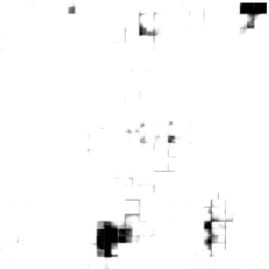

# GreenRoofNet
In recent years, uncontrolled urbanization and climate change have intensified environmental challenges in large cities. Milan, like many other urban centers, faces two major issues: high levels of air pollution and an increased risk of flooding due to impermeable surfaces. One potential solution that addresses both problems is the implementation of green roofs—vegetated roof surfaces that provide ecological, economic, and social benefits.

Green roofs contribute to air purification by absorbing fine particulate matter and reducing CO₂ levels. Additionally, they enhance stormwater management by absorbing rainwater and slowing down runoff, thus mitigating the risk of urban flooding. Furthermore, these roofs improve thermal insulation, reduce the urban heat island effect, and contribute to biodiversity by creating green spaces in densely built areas.

Given the potential of green roofs to improve urban environments, this project aims to develop a deep learning model for the automatic segmentation of potential green roof areas from high-resolution satellite images. Using a neural network, the model classifies each pixel in an image to determine whether it belongs to a rooftop that could potentially host vegetation. This segmentation process enables city planners and policymakers to identify suitable locations for green roof installations efficiently, facilitating informed decision-making for sustainable urban development.


---

## Table of Contents
- [Dataset](#dataset)
- [Deep Learning Model](#deep-learning-model)
- [Requirements](#requirements)
- [Usage](#usage)

## Dataset
### 1. Ground Truth Data
The starting point of this project was to establish a ground truth that could provide reliable information about which rooftops could potentially be converted into green roofs. This was made possible thanks to a [GeoJSON file](https://dati.comune.milano.it/dataset/ds1446_tetti-verdi-potenziali)  provided by the Municipality of Milan, which contains the coordinates of rooftops identified as potential green areas. We processed and cleaned this dataset to make it suitable for our analysis.

### 2. Choice of underlying Satellite Imagery
Once we obtained the GeoJSON file, we needed to use it as a mask on satellite images of Milan to generate the dataset required for training our model. This meant that we had to find high-resolution satellite images that aligned well with our GeoJSON data. However, this proved to be challenging since not many high-resolution satellite maps are publicly available. Additionally, some sources, like Google Maps, had a significant misalignment with our GeoJSON data, making them unsuitable for our needs.

We experimented with overlaying the GeoJSON on different satellite maps, testing Google Maps, Microsoft Azure Maps (formerly Bing Maps), and OpenStreetMap. After thorough evaluation, we found that Azure Maps was the best candidate, as it provided both high-resolution aerial imagery and the best alignment between our GeoJSON coordinates and the satellite images. 
| Azure Map               | Google Map                 |
|-------------------------|----------------------------|
|  |  |

### 3. Map preparation
We decided to create a simple webapp, `map.html` to visualize the map with the option to pan and to enable or disable the geojson mask, we went with this option because azure maps is mostly built to be used on the web, so this was the most documented and straightforward way to use it.

It is possible to see this map by running the `serve` command and opening `localhost:3000/map.html` (or equivalent port on your device) in the browser.

### 4. Dataset collection
We used Playwright to automate the process of capturing the map and the mask, we created a script `captureMap.js` that captures the map and the mask and saves them in the `dataset` folder.
it first goes through all the screenshot for unmasked images, then it enables the mask and pans back to the same coordinates and takes the screenshot with the mask. we decided to do it in this way to avoid waiting for the mask to load every time.

Assuming a good internet connection to load the satellite map, the script can do around 5 screenshots per second.

Some example images are shown below:

| Satellite image | Masked image |
|-----------------|--------------|
|  |  |

### 5. Dataset Preprocessing
At this point, the final step to prepare our dataset for training was to process the masks to ensure they contained only binary pixel values (0 and 1). This meant converting them into black and white labels, where 0 (black) represented potential green roofs and 1 (white) represented all other areas. These binary masks would serve as ground truth labels for our model.

Additionally, we needed to compress the dataset into a more efficient format. The previous script saved raw 600x600 .png images, and with a dataset containing 5000+5000 images, this resulted in a total size of around 5GB.

To optimize storage and speed up the training process, we decided to convert the images and masks into NumPy arrays and store them in a compressed .npz file. This significantly reduced the dataset size while maintaining efficiency for model training.

Below, we provide the function used to convert the screen with the mask into a black and white binary format, along with an example of an input pair (satellite image and corresponding mask) that will be used to train the model.

```python
def preprocess_image_and_mask(image_path, mask_path, target_size=(600, 600)):
    image = cv2.imread(image_path)
    image = cv2.cvtColor(image, cv2.COLOR_BGR2RGB)

    mask = cv2.imread(mask_path)
    mask_rgb = cv2.cvtColor(mask, cv2.COLOR_BGR2RGB)
    magenta = np.array([255, 0, 255])
    binary_mask = np.all(mask_rgb == magenta, axis=-1).astype(np.uint8)
    binary_mask = (1 - binary_mask)  # Invert values: magenta=0, everything else=1
    binary_mask = cv2.resize(binary_mask, target_size, interpolation=cv2.INTER_NEAREST)
    binary_mask = np.expand_dims(binary_mask, axis=-1)  # Add channel dimension
    
    return image, binary_mask
```

| Satellite image | Masked image |
|-----------------|--------------|
|  |  |

## Deep Learning Model

### 1. Approach and Methodology
Once we had our dataset we started building our neural network. To tackle this problem, we employed a **transfer learning** approach. Given the high resolution of the images, we selected architectures that accept 600 × 600 × 3 input dimensions.

Two models were chosen for experimentation:
- **EfficientNetB7**: A highly optimized CNN known for its strong feature extraction capabilities.
- **DeepLabV3+ with ResNet50**: A state-of-the-art segmentation architecture that combines deep residual learning with Atrous Spatial Pyramid Pooling (ASPP).

This report details the implementation of both models. For both models, we experimented with different hyperparameters and empirically determined the best ones. Additionally, we experimented with two different loss functions: Binary Cross-Entropy (BCE) and Focal Loss.

- Binary Cross-Entropy (BCE): This is the standard loss function for binary classification problems. It measures the difference between predicted probabilities and actual labels, penalizing incorrect predictions linearly.

- Focal Loss: A variation of BCE that introduces a focusing parameter (gamma) to reduce the relative importance of well-classified examples, thereby helping to handle class imbalance in segmentation tasks.

### 2. Model Architectures

#### 2.1. EfficientNetB7
We used EfficientNetB7 as a feature extractor, removing its top classification layer and keeping the pre-trained weights frozen to prevent overfitting. The extracted features were then passed through a custom decoder built with Conv2DTranspose layers for upsampling.

##### **Model Implementation**
```python
def build_model(input_shape=(600, 600, 3)):
    base_model = EfficientNetB7(weights='imagenet', include_top=False, input_shape=input_shape)
    base_model.trainable = False  # Freeze pre-trained weights

    inputs = keras.Input(shape=input_shape)
    x = base_model(inputs, training=False)

    # Decoder with Conv2DTranspose for upsampling
    x = layers.Conv2DTranspose(256, (3, 3), strides=2, padding='same', activation='relu')(x)
    x = layers.Conv2DTranspose(128, (3, 3), strides=2, padding='same', activation='relu')(x)
    x = layers.Conv2DTranspose(64, (3, 3), strides=2, padding='same', activation='relu')(x)
    x = layers.Conv2DTranspose(32, (3, 3), strides=2, padding='same', activation='relu')(x)
    x = layers.Conv2DTranspose(16, (3, 3), strides=2, padding='same', activation='relu')(x)

    x = layers.Cropping2D(((4, 4), (4, 4)))(x)

    # Output layer with sigmoid activation for binary segmentation
    outputs = layers.Conv2D(1, (1, 1), activation='sigmoid')(x)

    model = keras.Model(inputs, outputs)
    return model
```

##### **Training, Compilation and Evaluation**
We used a dataset of 5,000 non-normalized images for training. After numerous experiments with different configurations, this was found to be the best setup.

```python
optimizer = 'adam'
loss = keras.losses.BinaryFocalCrossentropy(gamma=2.0, from_logits=True)
metrics = ['accuracy', iou_metric]
batch_size = 20
epochs = 100
early_stopping = keras.callbacks.EarlyStopping(monitor='val_loss', patience=5, restore_best_weights=True)
```
| Metrics | Value | 
|:---------:|:---------:|
|  Accuracy   |   0.9129       |
|  Precision  |   0.9614       |
|  Recall     |   0.9400       |
|  IoU        |   0.6777       |

| Satellite image | Ground truth | Model output |
|---------------------------------|---------------------------------|---------------------------------|
|  |  |  |
|  |  |  |

#### 2.2. DeepLabV3+ with ResNet50
The second approach used DeepLabV3+, an advanced semantic segmentation model that builds on DeepLabV3 by adding a decoder module for improved boundary refinement. It employs ResNet50 as a backbone for feature extraction, utilizing its deep residual connections to capture hierarchical features at different levels.

A key component of DeepLabV3+ is Atrous Spatial Pyramid Pooling. ASPP applies dilated convolutions with different dilation rates (6, 12, 18) to process image features at multiple receptive fields, effectively balancing fine-grained details with broader spatial context. This makes DeepLabV3+ particularly well-suited for segmenting objects of varying sizes within high-resolution satellite images.

##### **Model Implementation**
```python
def build_model(input_shape=(600, 600, 3), num_classes=1):
    base_model = ResNet50(input_shape=input_shape, include_top=False, weights='imagenet')
    base_model.trainable = False  # Freeze ResNet50 weights

    # ASPP Module
    aspp = layers.Conv2D(256, (1, 1), padding="same", use_bias=False)(base_model.output)
    aspp = layers.BatchNormalization()(aspp)
    aspp = layers.ReLU()(aspp)

    aspp = layers.Conv2D(256, (3, 3), dilation_rate=6, padding="same", use_bias=False)(aspp)
    aspp = layers.BatchNormalization()(aspp)
    aspp = layers.ReLU()(aspp)

    aspp = layers.Conv2D(256, (3, 3), dilation_rate=12, padding="same", use_bias=False)(aspp)
    aspp = layers.BatchNormalization()(aspp)
    aspp = layers.ReLU()(aspp)

    aspp = layers.Conv2D(256, (3, 3), dilation_rate=18, padding="same", use_bias=False)(aspp)
    aspp = layers.BatchNormalization()(aspp)
    aspp = layers.ReLU()(aspp)

    # Decoder (Upsampling)
    x = layers.Conv2DTranspose(256, (3, 3), strides=2, padding="same")(aspp)
    x = layers.BatchNormalization()(x)
    x = layers.ReLU()(x)

    x = layers.Conv2DTranspose(128, (3, 3), strides=2, padding="same")(x)
    x = layers.BatchNormalization()(x)
    x = layers.ReLU()(x)

    x = layers.Conv2DTranspose(64, (3, 3), strides=2, padding="same")(x)
    x = layers.BatchNormalization()(x)
    x = layers.ReLU()(x)

    x = layers.Conv2DTranspose(32, (3, 3), strides=2, padding="same")(x)
    x = layers.BatchNormalization()(x)
    x = layers.ReLU()(x)

    x = layers.Cropping2D(((4, 4), (4, 4)))(x)

    # Final output layer with sigmoid activation
    outputs = layers.Conv2D(num_classes, (1, 1), activation='sigmoid')(x)

    model = keras.Model(inputs=base_model.input, outputs=outputs)
    return model
```

#### **Training and Compilation**
We used a dataset of 3,000 normalized images, Less than the previous one due to the limited resources of our development environment. After numerous experiments with different configurations, this was found to be the best setup.
```python
optimizer = 'adam'
loss = 'binary_crossentropy'
metrics = ['accuracy', iou_metric]
batch_size = 8
epochs = 50
early_stopping = keras.callbacks.EarlyStopping(monitor='val_loss', patience=5, restore_best_weights=True)

```
| Metrics | Value | 
|:---------:|:---------:|
|  Accuracy   |   0.9348       |
|  Precision  |   0.9561       |
|  Recall     |   0.9706       |
|  IoU        |   0.7378       |

| Satellite image | Ground truth | Model output |
|---------------------------------|---------------------------------|---------------------------------|
|  |  |  |
|  |  |  |

### 3. Ensamble Model
Given the poor results achieved by the models in the IoU metric, we thought of combining the two to create an ensemble. By combining the predictions of both models and computing their average, we observed a significant improvement in segmentation performance. This ensemble approach leverages the strengths of both architectures: the robust feature extraction of EfficientNetB7 and the detailed spatial understanding of DeepLabV3+. The final output benefits from a more balanced segmentation with improved boundary refinement and generalization capabilities.

| Metrics | Value | 
|:---------:|:---------:|
|  Accuracy   |   0.9500       |
|  Precision  |   0.9759       |
|  Recall     |   0.9668      |
|  IoU        |   0.8251      |

| Satellite image | Ground truth | Model output |
|---------------------------------|---------------------------------|---------------------------------|
|  |  |  |
|  |  |  |

## Requirements

- Node.js (tested with v18.0.0)
- Python 3 (tested with 3.12.4)

## Usage
### Dataset Creation Instructions
To generate the dataset, follow these steps carefully:

#### 1. Install Dependencies
Before running any script, you need to install the required dependencies. Run the following command in your terminal:

```sh
npm install
```
This will install all necessary Node.js packages listed in the package.json file.

Additionally, the dataset generation process uses Playwright, a tool for browser automation. To install Playwright, run:
```sh
npx playwright install
```
This ensures that all required browser engines are available for capturing satellite images.
#### 2. Start the Local Server
The dataset creation script relies on a local server to load map tiles and capture images. Start the server with:
```sh
serve
```
After running this command, a port number will be displayed in the terminal (e.g., http://localhost:3000).
#### 3. Configure the Capture Script
Copy the port number from the terminal output and paste it into the `captureMap.js`. You will typically need to update a line in the script where the local server address is defined, ensuring the script can properly load the satellite maps.
#### 4. 4. Run the Dataset Creation Script
Once the server is running and the correct port is set, execute the dataset generation script:
```sh
node captureMap.js
```
This script will:
- Load satellite images from the local server.
- Capture screenshots of the map tiles.
- Save the images as part of the dataset for training the model.
- After execution, your dataset will be available in the specified output directory.
## Models

### Installation

install python dependencies (might not be an exhaustive list)

```sh
pip install -r requirements.txt
```


### train the models

run the preprocessing script to prepare the dataset for training

```sh
python3 preprocessing.py
```

move to the models directory

to train DeepLabV3+ with ResNet50:

```sh
python3 DeepLabV3.py
```

to train EfficientNetB7:

```sh
python3 EfficientNetB7.py
```

it's possible to change models parameters (like epoch and batch size) directly in the scripts

### Usage

to use both models and the ensemble model, use the Evaluation notebook (be sure to modify it with the correct models file paths)

it's possible to use the already trained models present in the folder `Model`
